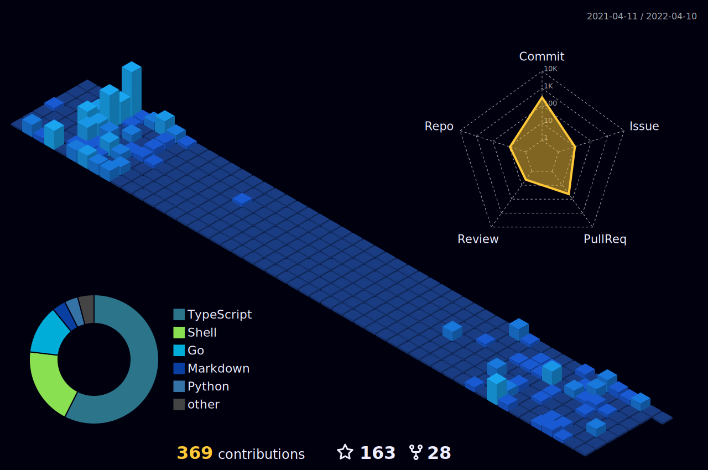

👋 Xin chào mọi người, cảm ơn vì đã ghé thăm GitHub của tôi!!!
Tôi là Nguyễn Trương Thiện Phát (Pcoder) 👑
<h1 align="center">  </h1>               
    
 
  
 
  
 </a> 
  
📰 Thông tin cá nhân

⚜️ Tên đầy đủ: Nguyễn Trương Thiện Phát
🎂 Ngày sinh: 26/02
📍 Đang sống tại: Bà Rịa - Vũng Tàu
👨‍💻 Biệt danh: Pcoder
🏗️ Lĩnh vực: Lập trình viên, phát triển API, phát triển web
🌐 Facebook: Nguyễn Trương Thiện Phát
🏆 Sở thích: Code, sáng tạo giao diện, nghiên cứu công nghệ mới

📝 Github Stats
 
📖 Top Languages

🤝🏻 Liên hệ với tôi

 &nbsp;  &nbsp;  &nbsp;  &nbsp;  &nbsp;  
   
